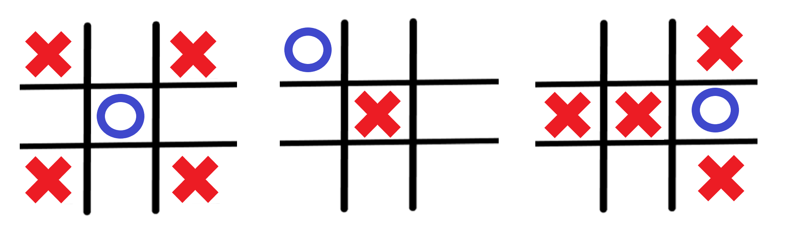

# TicTacToe_mobile_app
A tictactoe mobile app developed with the minimax algorithm using python and kivy.

This project is a practical implementation in kivy framework of the depth search minimax algorithm for optimal moves in a tictactoe game. The text will focus on the implementation, solutions to reach the ideal performance and the apk build. To better comprehend minimax logics of the code, visit [the minimax project](https://github.com/RodrigoMarquesP/TicTacToe_minimax_depth_search).


### Implementing:
The best framework to develop mobile applications with python is kivy, which just the basics are necessary for this project, but fell free to learn more and implement it in different ways.  
The simple structure that was followed is to heriting a kivy.uix.widget.Widget class and configure its interface and components in a '.kv' file, then call the Widget object inside our App class.  
The .kv file must have the same name of the App class, but without the name 'app', for example, my class name is 'MyApp' and I named the file 'my.ky', but if the name didn't have 'app' on it, then the name of the class and the .kv would be the same, like if the class name were 'GameBuilder', the file would be 'gamebuilder.kv'.  
At this specific project, inside the Widget object, I split the screen using GridLayout objects - which works similar to those from *matplotlib.pyplot* - and filling them with labels and buttons. The general configurations were just about colors, sizes, positions, paddings, font sizes and which text appears, making the game screen looks like this:
  

<p align="center">
  
</p>

  
The basic structure of the main.py code is:

````
class MainGrid(Widget):
    # game machanics


class MyApp(App):
    def build(self):
        game = MainGrid()
        return game


if __name__ == "__main__":
    MyApp().run()
````


### Performance:

As discussed in [the minimax project](https://github.com/RodrigoMarquesP/TicTacToe_minimax_depth_search), the search goes along almost six hundred thousand nodes when exploring all states, what haves a high time cost, and the problem is solved just when there's already two marks on the tictactoe board - the search of the seven left squares took less than one second in my computer. Considering that the mobile's resources are smaller than the computer's, we won't have a good performance at a 9 or 8 levels depth search. 

The solution that I came up with, was a trick already used in a lot of AI game agents to deal with the first moves - humans can't deal with deep searches, but they know by experiencing which are the better moves at the beginning of the game, so, they don't even have to think about. This way, if the agent knows what to do in the first two moves, it won't need to use the long search, but how to know the best two moves? We can just execute the minimax code to consult the utility of the states in each different possibility and organize this knowledge for the agent (a table, a list, an if state block).

For fully study the situation, we split it in two cases - machine does the first move of the game or machine does the second move of the game:  
* Nine levels depth search: when running the code, we notice that every move has zero utility — tie game — , so, the algorithm would choose any move when starting. Thus, the nine levels depth searches will return an aleatory move, which we can do simply, without any search.
* Eight levels depth search: this case is a little more complicated, but let's solve it. Executing the code several times in different positions, a pattern turns clear. There are three types of first moves that our agent must deal with, a mark in the middle of the board, at the corner, and at the side, and each one have its ideal responses. The three images below represent the situations, since the blue circle marks the first move, and the red X's marks the maximum utility responses:


<p align="center">
  
</p>

We can see that:
* If the first mark is in the middle, we must mark at a corner.
* If the first mark is in a corner, we must mark at the middle.
* If the first mark is in a side, we must mark at any position in the same row or column.

This strategy is implemented trough a class method in the script, that receive a tuple of the first mark coordinate and choose randomly between the explained possibilities of better moves.  

After those two treatments, the minimax algorithm just deal with seven or less levels of depth, which in my phone was pretty fast.

### Building the APk:

First of all, name your python file 'main.py', second, you must get buildozer. Buildozer is a tool to create the real applications from our python script, and it just runs on linux distributions (at least at the time I'm writing it). So, if you're not a linux user, you can rent a server or install a virtual machine like I did. After updating your linux server or machine, you can [install buildozer]((https://buildozer.readthedocs.io/en/latest/installation.html#targeting-android)). At the time I did it, was just type these commands on terminal and wait for a long installation:

````
sudo apt update && sudo apt upgrade
sudo apt install -y git zip unzip openjdk-8-jdk python3-pip autoconf libtool pkg-config zlib1g-dev libncurses5-dev libncursesw5-dev libtinfo5 cmake libffi-dev libssl-dev
pip3 install --upgrade Cython
pip3 install --upgrade buildozer
````

I came into a lot of trouble doing the installations in a wrong order, so follow it. After installing it correct, go to your project directory and execute:

````
buildozer init
````

This command creates a 'buildzer.spec' file, which needs to be open and modified. In this file that we set the application name, the icon, the load screen image and the requirements of it, like modules and file extensions to be downloaded or recognized. I put the altered code below to guide you:


````
# (str) Title of your application
title = Name_of_the_application


# (list) Source files to include (let empty to include all the files)
source.include_exts = py,png,jpg,kv,atlas,wav


# (list) Application requirements
# comma separated e.g. requirements = sqlite3,kivy
requirements = python3,kivy,numpy


# (str) Presplash of the application
presplash.filename = %(source.dir)s/loading_screen_image.png

# (str) Icon of the application
icon.filename = %(source.dir)s/icon_image.png
````

In this project, I added *numpy* module at the requirements and *wav* at the extensions included, the rest were already in the file when it was created. The used images need to be in the same directory of the project.  
After configuring the buildozer.spec file, save it and run the compiling code:

````
buildozer -v android debug
````

If everything gone right, it will create the apk file. The first time will be the longer, since the process will download android SDK and NDK, but next other compilings will be pretty fast. The apk file can be installed in any mobile device with a bigger android version than the minimum covered by buildozer. I also put my apk in this repository, for those who want to test or even run it without all the construction process.

**NOTE**: It's also possible to build an ios application. I didn't, but fell free to do it yourself.


