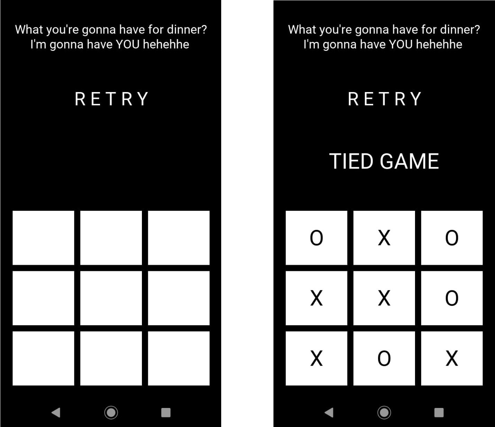
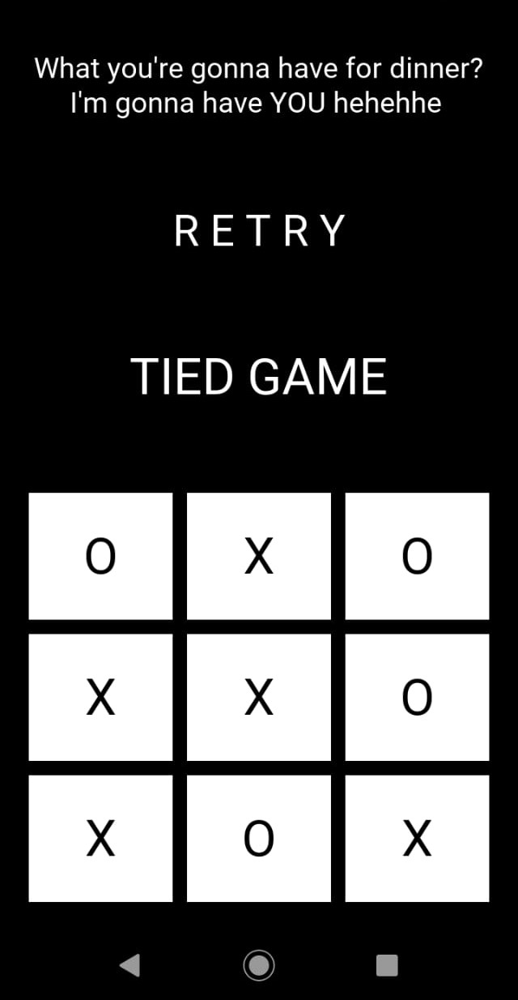

# TicTacToe_mobile_app
A tictactoe mobile app developed with the minimax algorithm using python and kivy.

This algorihtm is a practical implementation in kivy framework of the depth search minimax algorithm for optimal moves in a tictactoe game. The text will focus on the implementation, solutions to reach the ideal performance and the apk build. To better comprehend minimax logics of the code, visit [the minimax project](https://github.com/RodrigoMarquesP/TicTacToe_minimax_depth_search).


### Implementing:
The best framework to develop mobile applications with python is kivy, which just the basics are necessary for this project, but fell free to learn more and implement it in different ways. 
The simple structure that was followed is to heriting a kivy.uix.widget.Widget class and configure its interface and components in a '.kv' file. At this specific project, inside the Widget object, I split the screen using GridLayout objects - which works similar to those from *matplotlib.pyplot* - and filling them with labels and buttons. The general configurations were just about colors, sizes, positions, paddings, font sizes and which text appears, making the game screen looks like this:
  

<p align="center">
  
</p>

  
<p align="center">
  
</p>

  
The basic structure of the main.py code is:

````
class MainGrid(Widget):
    # game machanics


class MyApp(App):
    def build(self):
        game = MainGrid()
        return game


if __name__ == "__main__":
    MyApp().run()
````


### Performance:

As discussed in [the minimax project](https://github.com/RodrigoMarquesP/TicTacToe_minimax_depth_search), the search goes along almost six hundred thousand nodes when exploring all states, what haves a high time cost, and the problem is solved just when there's already two marks on the tictactoe board - the search of the seven left squares took less than one second in my computer. Considering that the mobile's resources are smaller than the computer's, we won't have a good performance at a 9 or 8 levels depth search. 

The solution that I came up with, was a trick already used in a lot of AI game agents to deal with the first moves - humans can't deal with deep searches, but they know by experiencing which are the better moves at the beginning of the game, so, they don't even have to think about. This way, if the agent knows what to do in the first two moves, it won't need to use the long search, but how to know the best two moves? We can just execute the minimax code to consult the utility of the states in each different possibility and organize this knowledge for the agent (a table, a list, an if state block).

For fully study the situation, we split it in two cases - machine does the first move of the game or machine does the second move of the game:  
* Nine levels depth search: when running the code, we notice that every move has zero utility — tie game — , so, the algorithm would choose any move when starting. Thus, the nine levels depth searches will return an aleatory move, which we can do simply, without any search.
* Eight levels depth search: this case is a little more complicated, but let's solve it. Executing the code several times in different positions, a pattern turns clear. There are three types of first moves that our agent must deal with, a mark in the middle of the board, at the corner, and at the side, and each one have its ideal responses. The three images below represent the the situations, since the blue circle marks the first move, and the red X's marks the maximum utility responses:


